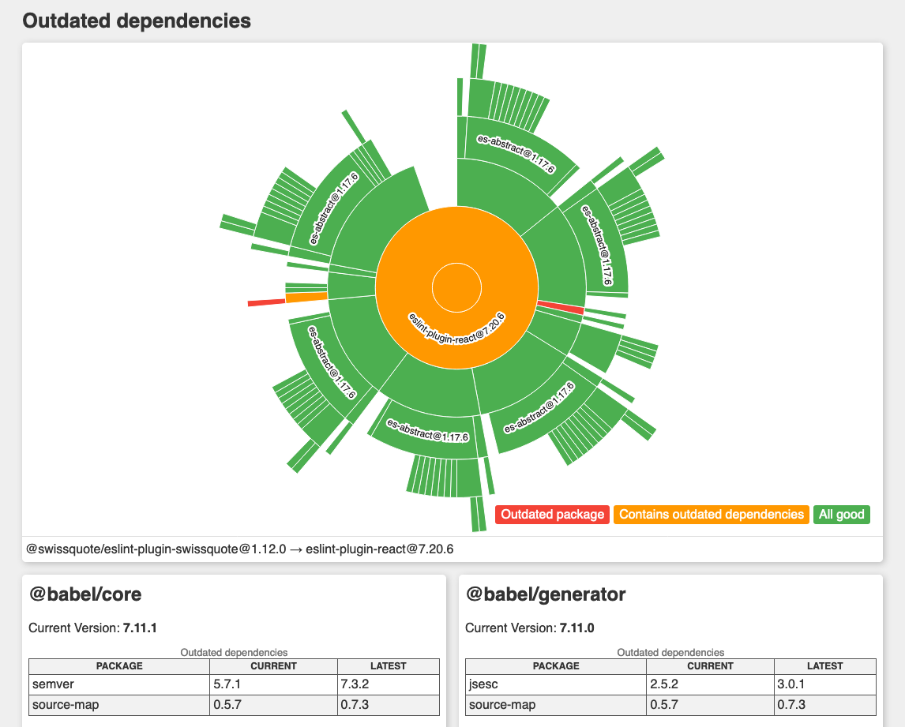

# Outdated dependencies visualizer

[](https://github.com/onigoetz/visualize-outdated-dependencies/releases)

[](https://www.npmjs.com/package/@onigoetz/outdated-dependencies)



Check the state of dependencies of your package and all of its dependencies.

Contrary to `yarn outdated` or `npm outdated`, this package will check the dependencies recursively and provide a full report.

This works with Yarn workspaces; run the command at the root of a workspace, and all its children will be included.

## Installing

```bash
npm install -g @onigoetz/outdated-dependencies
```

## Usage

Run the command within one of your modules.

```bash
outdated-dependencies
```

## Options

```
  --clear-cache Clear dependencies cache
  --help        Show help
  --version     Show the version and exit
  --verbose, -v Also display debug information
```
